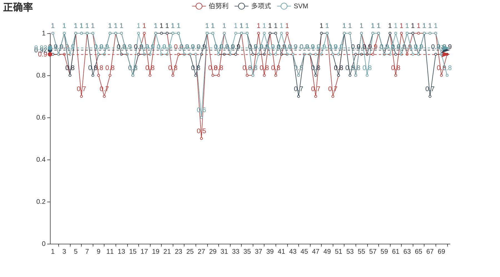
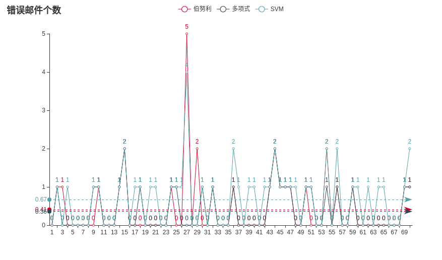
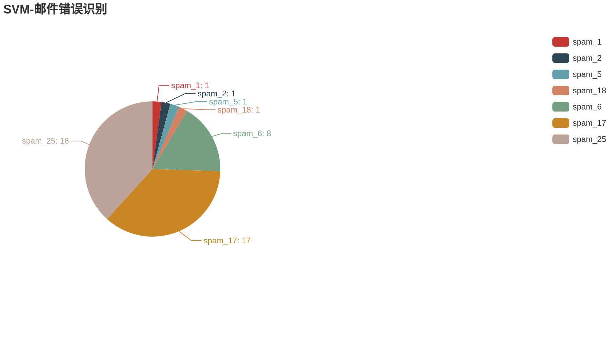
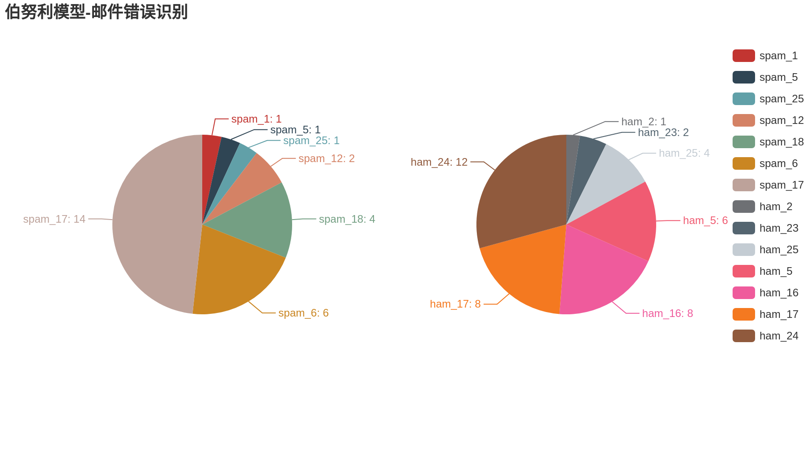
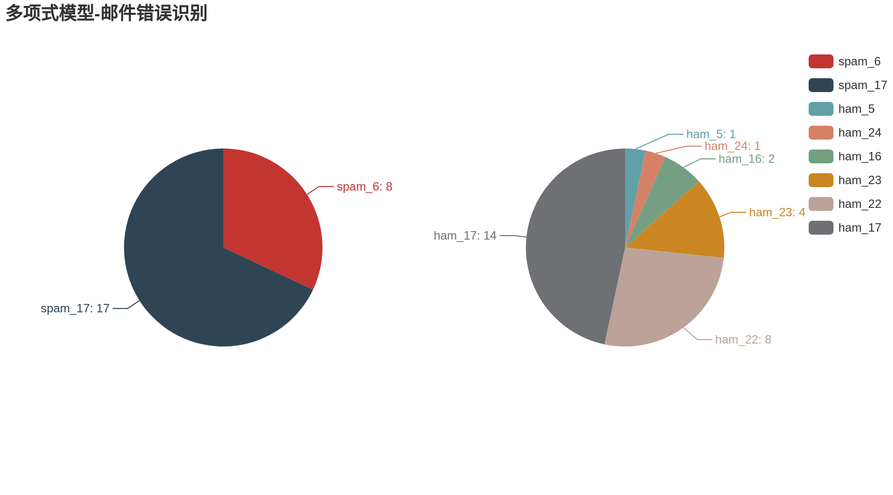

# 邮件分类（贝叶斯+SVM）

## bayes.py

### Prerequisites

---

- Python3
- pandas
  - 用于保存自定义测试集下训练邮件内的单词
- pyecharts>=1.0.0
  - 个人喜欢用pyecharts来做图，如果你希望使用其他作图工具，可以自动修改draw_result()函数，如果您不希望作图，可以手动注释掉bayesian.draw_result()这条语句，位于751行。注意的是，pyecharts最后保存出来的是html文件
- snapshot_selenium
  - 将pyecharts保存的html文件生成图片，您需要使用到chromedriver，请手动下载，如果不下载的话，您可以注释掉所有make_snapshot()语句，或者忽略终端报出来的错误
- skleran
  - 贝叶斯分类器是自己实现的，但SVM调用的是现成的库函数
- nltk
  - 用于去停用词和词性还原，需要下载一些包，您可以去官网下载，或者在百度云里下载：链接：https://pan.baidu.com/s/1_eU5sTe2bMWMJaqxA7IO8w 提取码：0pc9 ，您可以不用下载所有的包，只需要下载corpora中的stopwords和wordnet、stemmers中的porter_test和rslp、taggers中的averaged_perceptron_tagger。然后将这些文件放于C:\Users\xxxxx\AppData\Roaming\nltk_data即可）

### Getting Start

---

- 参数解释：

```
--model：模型的选择，默认为5
	- 单使用伯努利模型为1
	- 单使用多项式模型为2
	- 单使用SVM为3
	- 三个模型同时测试，并且你已经将邮件的测试集和训练集准备好的，为4
	- 三个模型同时测试，并且邮件的训练集和测试集为随机生成，为5
--train_path：训练集（或总文件）的路径，默认为'train'
--test_path：测试集路径，默认为'test'
--test_times：测试的次数，每次测试随机生成的测试集均不一样，默认为1
--test_file_num：每一类进行测试的邮件数目，默认为5
注意，train和test文件夹下，各自建立子文件夹spam和ham来分别存放垃圾邮件和正常邮件
```

- 使用方法为：

```
python bayes.py --model 5 --test_times 70
```

```python
python bayes.py --model 5 --train_path 'train' --test_times 70 --test_file_num 5
```

```python
python bayes.py --model 5 --train_path 'train' --test_path 'test' --test_file_num 5
```

- 结果：

如果你使用第一条命令来进行训练和测试，那么你将会得到三个模型测试后的正确率、错误邮件个数，以及三个模型对应的识别错误的邮件分布情况，如下所示：











除此之外，在终端上，你可以看到用来作出这些图片的数据。